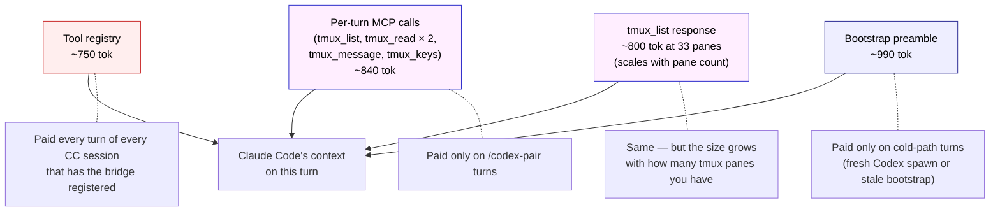
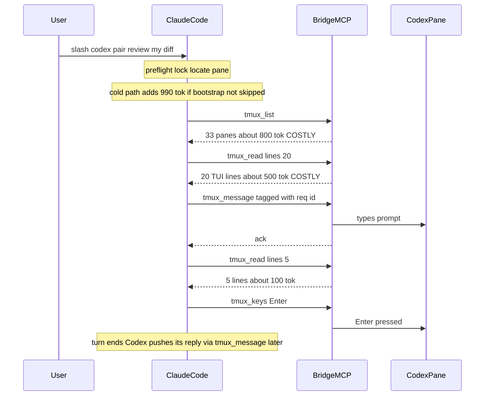
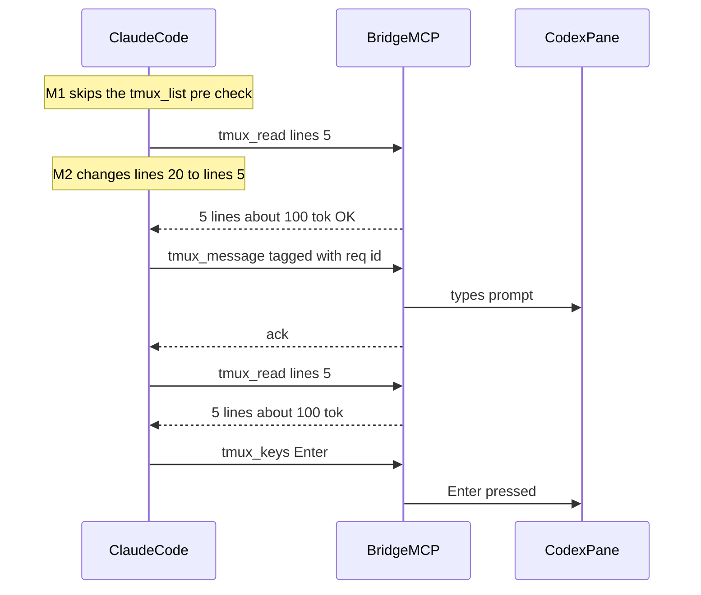
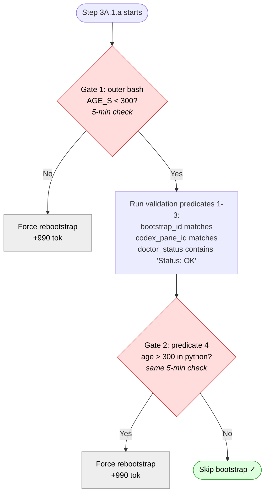
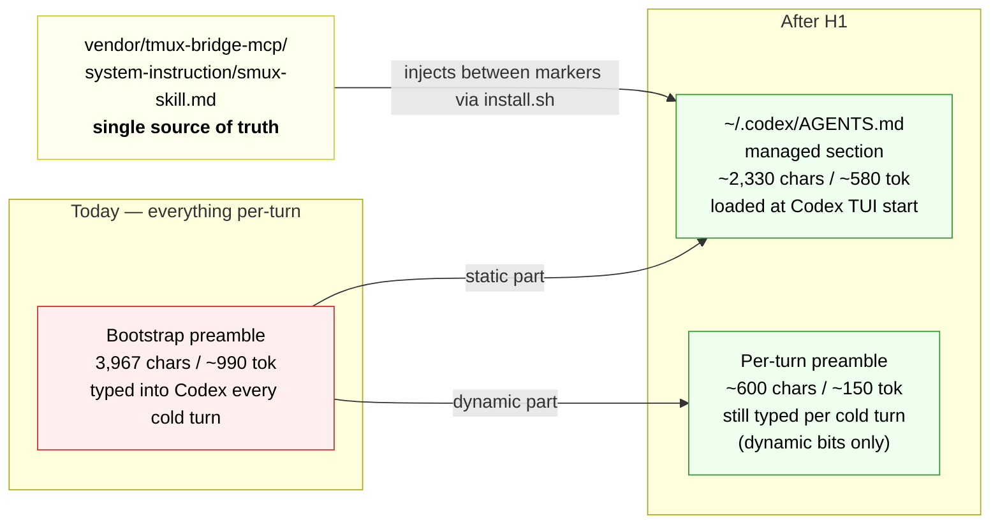
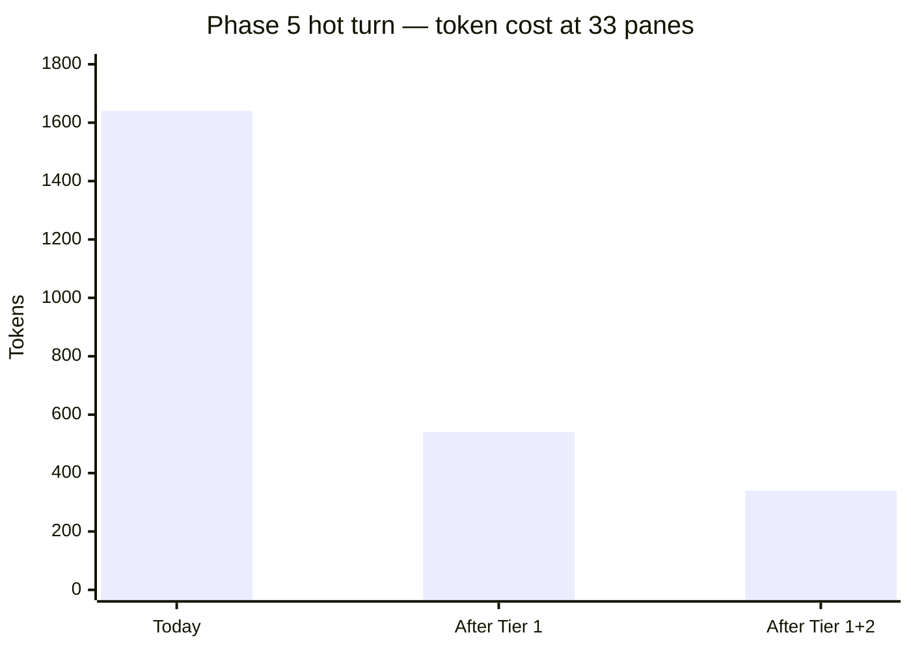
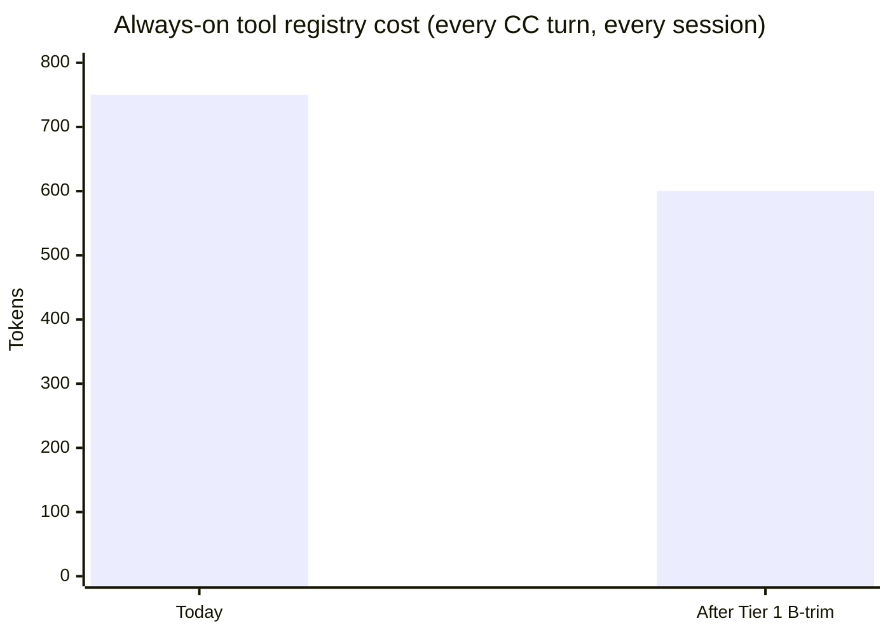

# Token-Cost Optimization Research — codex-pair + tmux-bridge

Two parallel research agents (2026-05-02) audited where token cost
shows up in this skill. Codex (rounds 1 and 2 of pressure-testing,
same day) returned **GO-with-conditions** then **GO** after revision.
This document is the Codex-confirmed plan.

**Read this when:** revisiting the codex-pair skill or the
tmux-bridge MCP server with optimization in mind. Each finding cites
file:line so future-you can verify status before acting — the codebase
may have moved since this snapshot.

---

## Executive summary

Three cost surfaces (all numbers below assume the live measurement
context: 33 active tmux panes, ~500-char user prompt — dated
snapshot from 2026-05-02; live `tmux_doctor` at 2026-05-10 reported
**53 panes**, so M1 scales upward in the user's actual environment).

1. **Per-turn MCP calls** (Phase 5 hot path): ~1640 tok / turn at 33
   panes. Dominated by `tmux_list` (~800 tok response — scales with
   pane count) and two `tmux_read` responses (~700 tok). Codex
   round-1 surfaced that the original draft underestimated `tmux_list`
   by assuming ~10 panes.
2. **Bootstrap preamble** (Phase 5 cold path): adds ~990 tok / turn
   when not skipped. Today's 5-min skip TTL means any user idle past
   5 min pays the cold path again. Cold turn ≈ 1.7× hot turn at 33
   panes.
3. **Always-on tool registry**: ~750 tok / turn for the lifetime of
   every CC session that has the bridge registered, regardless of
   whether `/codex-pair` is invoked. Pure overhead until used.

**After Tier 1 + Tier 2 land** (conservative measurement at 33 panes):

| Surface | Today | After | Reduction |
|---|---|---|---|
| Always-on registry | ~750 tok | ~600 tok | ~20% |
| Hot Phase 5 turn (33 panes) | ~1640 tok | ~340 tok | ~80% |
| Cold Phase 5 turn (33 panes) | ~2780 tok | ~750 tok | ~73% |

The hot-turn savings come overwhelmingly from M1 (drop pre-flight
`tmux_list`) + M2 (`lines=20` → `lines=5`). H1's AGENTS.md
injection adds **~580 tok always-on per Codex session** in exchange
for ~370 tok per cold-path turn — net positive only for users whose
codex-pair-turn density justifies it.

---

## Quick orientation (read this first)

This section exists for skim-readers. The audit-section detail is
preserved below for anyone who wants to dive in.

### Glossary

| Term | Plain meaning |
|---|---|
| **MCP** | Model Context Protocol — the way Claude Code talks to external tools. The `tmux-bridge` MCP server provides 9 tools (`tmux_read`, `tmux_message`, etc.) for cross-pane messaging. |
| **Tool registry** | The list of MCP tools Claude Code sees. Each tool's name + description + parameter schema is visible to the model **on every turn** of every CC conversation that has the server registered. Pure overhead until you actually use a tool. |
| **Phase 5 / Phase 1** | Two transports for `/codex-pair`. Phase 5 = bidirectional via the bridge (preferred). Phase 1 = one-way via raw tmux send-keys + scrollback polling (fallback when the bridge isn't installed). All numbers below are about Phase 5. |
| **Hot path** | A `/codex-pair` turn where the bootstrap handshake is skipped because Codex is already set up. Cheaper. |
| **Cold path** | A `/codex-pair` turn that runs the full bootstrap handshake (fresh Codex pane, or skip-validation failed). ~990 tok more expensive than hot. |
| **Bootstrap preamble** | The contract document `/codex-pair` types into Codex on cold-path turns to teach it the bridge contract + correlation tags + pane labeling. Currently 3,967 chars / ~990 tok. |
| **Read-guard** | A per-pane file flag the bridge keeps in `/tmp/tmux-bridge-guards/`. Tools like `tmux_message` refuse to run unless a `tmux_read` of the same pane ran first. Forces "look before you write." |
| **TTL** | Time-to-live. The freshness window before bootstrap state is considered stale and a re-bootstrap is forced. Currently 5 min. |
| **`%N`** | A tmux pane ID. Stable for the life of a tmux server. The bridge's `from:` / `pane:` headers carry these. |
| **Always-on** | Cost the model pays *every* turn, regardless of whether `/codex-pair` is being invoked. Tool registry overhead falls in this bucket. |

### What costs tokens, where



The three colors map to the three "cost surfaces" from the executive
summary. Red bleeds into every CC session whether you use the skill
or not; purple is per-/codex-pair-turn; blue is the extra cold-path
tax.

### A typical Phase 5 turn today (delivery half)



The two 🔴 calls (steps 2 and 4) are the costly ones. The `tmux_list`
returns every pane on your tmux server (33 here, ~3 KB); the first
`tmux_read` returns 20 lines of Codex's TUI scrollback that we don't
actually use — it only exists to satisfy the bridge's "read before
you write" guard.

### The same turn after Tier 1 (M2 + M1)



Two costly steps gone. ~1100–1300 tok saved per delivery turn. Zero
contract changes — both are SKILL.md edits.

### The H2 finding visualized: two TTL gates, not one

`/codex-pair`'s skip-bootstrap logic in Step 3A.1.a has **two** 5-min
freshness checks. The original H1 plan said "bump the TTL one line."
Codex's round-1 catch was that updating only the outer check leaves
the inner one at 5 min, so the effective TTL stays at 5 min and the
"savings" never materialize.



The two red diamonds are both 5-min checks. Both must move together
(or be replaced with one shared `TTL_S` constant). H2 in the rollout
spells this out.

### The H1 finding visualized: where the bootstrap preamble can move

H1 splits today's monolithic 3,967-char preamble into a static part
that Codex can load once at startup (via `~/.codex/AGENTS.md`) and a
small dynamic part that still has to be sent per-turn (because it
carries this turn's UUID, pane IDs, and session paths).



**What goes in AGENTS.md (once at Codex startup):** the static bridge
contract — read-before-act, never poll, pane-ID routing, tool
quick-reference. Lifted whole from the bridge's own
`smux-skill.md`.

**What stays in the per-turn preamble:** anything that changes
per-turn — `BOOTSTRAP_UUID`, the CC pane ID for *this* turn (`%2`),
the session dir path, the file-ACK protocol, correlation-tag
instructions, labeling commands.

The tradeoff Codex flagged in round 3: AGENTS.md is loaded into
Codex's system-instruction context at TUI startup, so the ~580 tok
**becomes always-on for every model invocation in any Codex
session** that loads the managed section — not just `/codex-pair`
sessions. Net positive only for users with enough `/codex-pair` cold
turns per Codex session to amortize.

### Rollout tier roadmap

```mermaid
flowchart LR
    subgraph T1 ["Tier 1: ship today, no contract change"]
        direction TB
        M2["M2 — lines=20 → 5<br/>SKILL.md only"]
        M1A["M1-A — drop tmux_list<br/>SKILL.md only"]
        BT["B-trim — workflow trims<br/>tmux-bridge-mcp src/index.ts<br/>(keep operational hints!)"]
    end

    subgraph T2 ["Tier 2: install.sh + SKILL.md surgery"]
        direction TB
        H1["H1 — markered AGENTS.md inject"]
        H2["H2 — both TTL gates + tmux_id() probe"]
    end

    subgraph T3 ["Tier 3: bridge API change, upstream coord"]
        direction TB
        M3["M3 — relax tmux_keys guard"]
        M4["M4 — composite tmux_send_message"]
        M1B["M1-B — tmux_exists tool"]
    end

    T1 --> T2 --> T3

    classDef tier1 fill:#dfd,stroke:#393,color:#000
    classDef tier2 fill:#ffd,stroke:#cc3,color:#000
    classDef tier3 fill:#dde,stroke:#339,color:#000
    class M2,M1A,BT tier1
    class H1,H2 tier2
    class M3,M4,M1B tier3
```



Green = pure win, ship today. Yellow = needs install.sh + SKILL.md
surgery, no bridge API change. Blue = bridge API change, defer until
upstream PR cycle catches up.

### Per-turn cost: before vs. after





(Numbers are conservative estimates — real measurement may vary
±10%.)

---

## Audit A — Per-turn MCP call cost (codex-pair skill)

### Per-turn MCP call walkthrough (Phase 5 hot path)

A "turn" spans **two CC invocations** because Codex's reply arrives as
a fresh push:

- Turn A (delivery): Steps 0 → 0.5 → 1 → 3A.1 → 3A.2.
- Turn B (reply handler): Step 3A.3 — file I/O only, no MCP calls.

**Hot path (bootstrap skip), Turn A — 5 MCP calls:**

| # | Tool | Args | Why | Response |
|---|---|---|---|---|
| 1 | `tmux_list` | `{}` | Verify Codex pane still exists (3A.2.b step 1) | One line per pane × N panes. **Scales with `total_panes` — at 33 panes ≈ 3–4 KB / ~800 tok.** Originally underestimated at low pane counts. |
| 2 | `tmux_read` | `{target:"%99",lines:20}` | Satisfy read-guard before message | Last 20 lines of Codex TUI, **~1500–3000 chars / ~400–800 tok** |
| 3 | `tmux_message` | `{target:"%99",text:"[req:abcd1234] <PROMPT>"}` | Deliver tagged prompt | `Message sent to %99` (~25 chars) |
| 4 | `tmux_read` | `{target:"%99",lines:5}` | Re-read to verify text landed | ~300–600 chars / ~80–150 tok |
| 5 | `tmux_keys` | `{target:"%99",keys:["Enter"]}` | Submit | ~28 chars |

Hot-path total: args ≈ 80–100 tok; responses ≈ 1300–1800 tok at 33
panes. `tmux_list` and the first `tmux_read` dominate.

**Cold path (FRESH_SPAWN or skip-fail) adds the bootstrap preamble:**
3,967 chars / ~990 tok of contract document delivered via Phase 1
mechanics (`load-buffer`/`paste-buffer`). Costs zero MCP-tool tokens
(it's typed, not tool-called) but it IS in CC's context as it executes
the SKILL.md script — so the skill text itself contains 3,967 chars
the model parses on every Phase 5 turn, hot or cold.

### Cost breakdown (33 panes, ~500-char user prompt)

| Bucket | Hot tok | Cold tok | % of cold |
|---|---|---|---|
| Tool args (incl. `[req:8hex]` tag ≈ 20 chars) | ~80 | ~80 | 3% |
| `tmux_list` response (scales with pane count) | ~800 | ~800 | 29% |
| `tmux_read × 2` responses | ~700 | ~700 | 25% |
| Bootstrap preamble (in-skill text emitted to paste) | 0 | ~990 | 36% |
| Correlation tags (`[req:8hex]` send + `[reply-to:8hex]` recv) | ~10 | ~10 | <1% |
| State files (pending, bootstrap.json, health.json) | ~50 | ~200 | 7% |
| **Total per turn (excl. tool registry, excl. user prompt)** | **~1640** | **~2780** | |

`tmux_list` is the single biggest dynamic-cost variable.

---

## Audit B — Always-on tool registry footprint (tmux-bridge-mcp)

The 9 MCP tools live in CC's tool registry for every turn of every CC
session that has the bridge registered. Pure overhead until used.

| Tool | Name chars | Desc chars | Param count |
|---|---|---|---|
| `tmux_list` | 9 | 70 | 0 |
| `tmux_read` | 9 | 152 | 2 |
| `tmux_type` | 9 | 184 | 2 |
| `tmux_message` | 12 | 173 | 2 |
| `tmux_keys` | 9 | 90 | 2 |
| `tmux_name` | 9 | 110 | 2 |
| `tmux_resolve` | 12 | 39 | 1 |
| `tmux_id` | 7 | 79 | 0 |
| `tmux_doctor` | 11 | 80 | 0 |

Shared param descriptor `"Pane target: ID (%0), session:win.pane,
or label"` (50 chars) appears on **5 tools = 250 chars of repetition**.

Total registry footprint:
- Sum of names: 87 chars
- Sum of descriptions: ~977 chars
- Sum of param-description strings: ~430 chars
- Schema JSON structural overhead: ~700 chars
- **Total ≈ 2,100–2,400 chars ≈ 525–600 tok of pure schema.**
- After MCP envelope + JSON quoting: **~750 tok per turn.**

---

## Reduction opportunities (organized by rollout tier)

Sections are ordered by **rollout priority**, not severity. Inline
"Severity:" tags preserve the original audit grading — for traceability
when coming back to this doc — but they don't dictate the order in
which to ship.

### Tier 1 — ship today, no contract change

#### M2 — Reduce read-guard read `lines=20` → `lines=5`
- **Severity:** low. **Impact:** medium-high (~300–500 tok/turn).
- 3A.2.b step 2 only needs to satisfy the guard; CC isn't doing
  anything with the output. The verifying re-read at step 4 is
  `lines=5` already. Match it.
- Risk: NONE. Guard is a file-existence flag (`tmux-bridge.ts`
  ~L24-33); it cares that `read` ran, not what was returned.
- Touch: SKILL.md only. One number swap.

#### M1, Option A — Drop pre-flight `tmux_list` in 3A.2.b
- **Severity:** medium (Codex round-1 promoted from low). **Impact:**
  HIGH (~800 tok/turn at 33 panes; scales with pane count).
- `bridge.message()` already calls `validateTarget(resolved)`
  internally (`tmux-bridge.ts` ~L418), which fails cleanly if the
  pane is gone. The pre-check is redundant.
- Risk: LOW. `bridge.message`'s error → handle the same way 3A.2.b
  currently handles absence (delete pending file, fall through to
  error path).
- Touch: SKILL.md only. Delete the `tmux_list` step.

#### B-trim, conservative — Workflow-narrative trims to bridge tool descriptions
- **Severity:** low. **Impact:** medium (~150 tok always-on, ~20%
  registry).
- Codex round-1 hard requirement: **keep operational hints** in
  descriptions: "Read first" / "no Enter" / "cannot target self".
  These steer Claude when the skill isn't in focus.
- Safe trims:
  - Drop repeated `target` describe (5×) — keep one canonical
    example elsewhere in the contract doc.
  - Trim verbose workflow narratives in `tmux_read`, `tmux_type`,
    `tmux_message` — keep the operational hints, drop the long-prose
    redundancy.
  - Compact `tmux_id`, `tmux_doctor` (no behavioral hints to lose).
  - Drop redundant `.describe()` on params where parent description
    is self-explanatory.
- Risk: very low.
- Touch: tmux-bridge-mcp `src/index.ts` only.

**Tier 1 total savings: ~1100–1300 tok / Phase 5 turn + ~150 tok /
every CC turn.**

### Tier 2 — install.sh / SKILL.md changes, no bridge API change

#### H1, revised — Inject markered static contract into `~/.codex/AGENTS.md`
- **Severity:** medium. **Impact:** ~370 tok / cold-path turn + ~80
  tok / hot turn (SKILL.md text shrinkage). **Cost:** ~580 tok
  always-on in **every** Codex session, not just codex-pair.
- Codex CLI loads `~/.codex/AGENTS.md` at TUI startup (verified by
  Codex round 1: `codex debug prompt-input` on 0.128.0). Home content
  renders first, then `--- project-doc ---`, then project content.
  Project effectively comes later. Direct system/developer/user
  instructions still outrank AGENTS.
- **What goes in:** the static generic bridge contract. Source of
  truth: `vendor/tmux-bridge-mcp/system-instruction/smux-skill.md`
  (52 lines, 2,330 chars, ~580 tok). install.sh injects the **whole
  file** between markers — it's already generic and pair-agnostic, so
  no subset-extraction rule needed.
- **What stays in the per-turn preamble:** dynamic codex-pair
  specifics — CC pane (`%2`-style ID this turn), session dir,
  `BOOTSTRAP_UUID`, file-ACK protocol, correlation-tag instructions
  (`[req:<uuid>]` / `[reply-to:<uuid>]`), labeling commands.
- **Markered injection:**
  ```
  <!-- codex-pair:begin (managed by ~/.claude/skills/codex-pair/install.sh) -->
  ... (whole content of vendor/tmux-bridge-mcp/system-instruction/smux-skill.md) ...
  <!-- codex-pair:end -->
  ```
  Replace only that section. Create the file if missing. Uninstall
  removes only the section.
- **Live-pane caveat:** running Codex sessions don't see edits until
  TUI restart. install.sh should print this.
- **Net economics (rough):** if a user's codex-pair cold turns happen
  more than ~1.6× per Codex non-pair session (so cold-turn savings
  ~370 × N exceed the always-on cost ~580), H1 is a win. Otherwise
  it's a regression for that user. Document the tradeoff in
  install.sh's output. Phrase the cost precisely: AGENTS.md is loaded
  into Codex's system-instruction context, so the section adds
  **~580 model-visible tokens to every Codex turn that loads the
  managed AGENTS.md section** (not a one-time install/session
  storage cost). Codex round-3 wording nuance.
- Risk: LOW once markered injection lands. Idempotent re-runs and
  uninstall both work cleanly.
- Touch: install.sh + SKILL.md preamble surgery.

#### H2, revised — Extend skip-TTL with BOTH gates updated + cheap health probe
- **Severity:** medium. **Impact:** amortizes cold-path cost across
  more turns (idle-then-resume case in particular).
- Codex round-1 correction: Step 3A.1.a has **two** 5-min gates, not
  one:
  1. Outer bash: `if [ "$AGE_S" -lt 300 ]; then ... predicate run ...`
  2. Inner python (predicate 4): `if age > 300 or age < -60`
- Define `TTL_S=1800` (or chosen value) once at the top of the block;
  reference it in both gates. Otherwise updating only one keeps the
  effective TTL at 5 min.
- **Stale-tool-surface mitigation** (round-1 HIGH from Codex):
  predicate 3 doesn't re-run `tmux_doctor` — it just checks the
  *cached* `doctor_status` from the previous bootstrap. Extending TTL
  could mask Codex-side MCP tool loss, config drift, or tmux-server
  restart. Mitigations:
  - Add a single `tmux_id()` call on the skip-path. If it errors,
    force rebootstrap. Adds ~10 tok/turn but catches Codex-side MCP
    loss for free.
  - Promote `--rebootstrap` in user-facing error messages as the
    recovery flag.
- Risk: LOW with the probe; MEDIUM without.
- Touch: SKILL.md only.

**Tier 2 total savings (codex-pair-heavy users): ~450 tok / cold turn
+ ~80 / hot turn. Tier 2 cost (always, every Codex session): ~580 tok.**

### Tier 3 — bridge API changes, coordinate with upstream

#### M3 — Relax read-guard for `tmux_keys` only
- **Severity:** medium. **Impact:** ~300 tok/turn savings.
- `tmux_keys` is keystrokes (Enter), not content overwriting — a
  sticky guard for `tmux_type`/`tmux_message` while relaxing for
  `tmux_keys` lets the skill do read → message → keys without the
  second `tmux_read`.
- Risk: MEDIUM. Bridge contract change. Coordinate with upstream PR
  cycle.

#### M4 — Composite delivery tool `tmux_send_message`
- **Severity:** new (Codex round-1). **Impact:** ~600 tok/turn.
- Add a single bridge tool that internally captures-as-mark, writes,
  verifies compactly, and sends Enter:
  ```
  tmux_send_message(target, text, submit=true, verify_lines=5)
    → { ok: bool, sent: bool, verified: bool }
  ```
  Collapses `tmux_read + tmux_message + tmux_read + tmux_keys` (4
  calls) into 1. Preserves safety (verify still happens, internalized).
- Risk: MEDIUM. Bridge change; might not fit upstream's primitive-tool
  philosophy. Defer until clear value signal.

#### M1, Option B — Add narrow `tmux_exists(target)` tool
- **Severity:** new (Codex round-1, alternative to M1 Option A).
  **Impact:** same ~800 tok/turn savings as Option A.
- Cleaner explicitness than relying on `bridge.message` errors. ~30
  chars of new registry overhead.
- Defer: Tier 1 M1-A is the zero-bridge-change path that gets the
  same savings.

### LOW (not in tier order — small / contingent gains)

- **L1** — Shorten correlation tags 8 hex → 6 hex. Negligible (~2
  tok/turn). Bundle if other contract changes happen.
- **L2** — Drop `prompt_preview` from `pending/<req>.json`. Local
  file only; trivial token cost.

---

## Codex review traceability

### Round 1 (req `cda99da1`) — GO-with-conditions

11 findings; all folded into the body above.

| Finding | Severity | Resolution |
|---|---|---|
| H1 has unpriced global-context cost — AGENTS.md loads for every Codex session | HIGH | Scoped H1 to static contract only; explicit always-on cost in exec summary |
| H1 install must be markered + preserve user edits | HIGH | Specified `<!-- codex-pair:begin --> ... <!-- codex-pair:end -->` markers, single source of truth from smux-skill.md |
| H1 source-of-truth detail | MEDIUM | Explicit split: static → AGENTS.md; dynamic → preamble |
| H2 "one-line TTL" is wrong — TWO 5-min gates | HIGH | H2 specifies both gates + define TTL once |
| H2 overstates safety — predicate 3 uses STALE doctor_status | HIGH | Stale-tool failure modes documented + cheap `tmux_id()` probe + `--rebootstrap` recovery |
| B-trim risk: descriptions drive Claude's tool-use | MEDIUM | Split into "safe (workflow-narrative only)" vs "rejected (operational hints)" |
| Cost breakdown understates `tmux_list` at high pane counts | MEDIUM | Re-stated at 33 panes; promoted M1 to Tier 1 with HIGH impact |
| M2 should be promoted | MEDIUM | M2 is now first in Tier 1 |
| Composite `tmux_send_message` tool | NEW | Added as M4 (Tier 3) |
| `tmux_exists(target)` (cheaper than tmux_list) | NEW | M1 Option B (Tier 3) |
| Avoid always-on Claude-side bridge registration | NEW | Captured in "Open questions" |

### Round 2 (req `7d983e79`) — GO-with-remaining-conditions (doc consistency only)

4 doc-consistency items; all addressed in this revision.

| Finding | Severity | Resolution |
|---|---|---|
| Exec-summary numbers contradict rollout numbers (low-pane vs 33-pane mix) | MEDIUM | Exec summary now uses 33-pane baseline consistently. Single reduction table. |
| Registry savings inconsistent (~570/~25% vs ~600/~20%) | LOW/MEDIUM | Standardized on the conservative ~600 tok / ~20% throughout |
| M2 still labeled MEDIUM under MEDIUM section even though rollout says first | LOW | Restructured by **rollout tier** (Tier 1 / 2 / 3); severity becomes inline metadata, not section header |
| H1 source sizing imprecise (smux-skill.md is ~2.3 KB, not the ~1.5 KB / ~375 tok claimed) | LOW | Measured: 2,330 chars / 52 lines / ~580 tok. H1 specifies "whole file injected, no subset rule needed" + always-on cost updated to ~580 tok |

After round 2: Codex flagged **no remaining no-go issues**. The
revisions above address each consistency item directly.

### Round 3 (req `6208e456`) — GO

Codex re-read the revised file and confirmed all four round-2 items
are cleaned up. Verdict: **GO**. One wording nuance for install.sh
output (not a blocker): phrase the H1 cost as "adds ~580
model-visible tokens to every Codex turn that loads the managed
AGENTS.md section" rather than implying it's a one-time install or
session storage cost. Folded into the H1 finding above.

---

## Recommended rollout order

The tier sections above are already ordered. Implementation gets
the cheapest pure wins first, then the larger ones that need
install.sh / contract surgery, then bridge changes.

1. **M2** — `lines=5` swap. (Tier 1.)
2. **M1, Option A** — drop pre-flight `tmux_list`. (Tier 1.)
3. **B-trim, conservative** — workflow-narrative trims; keep
   operational hints. (Tier 1.)
4. **H1** — markered AGENTS.md injection from smux-skill.md, with
   net-economics note in install.sh output. (Tier 2.)
5. **H2** — both TTL gates + `tmux_id()` probe. (Tier 2.)
6. **M3, M4, M1-B** — bridge API changes. Defer; coordinate with
   upstream PR cycle. (Tier 3.)

After 1–5 land (33-pane baseline):
- Always-on registry: ~600 tok (from 750), ~20%
- Hot Phase 5 turn: ~340 tok (from 1640), ~80%
- Cold Phase 5 turn: ~750 tok (from 2780), ~73%

---

## Open questions (deferred — would benefit from a future review)

1. **Avoid always-on Claude-side bridge registration?** (Codex round
   1 NEW.) If `/codex-pair` can drive the Claude side via raw tmux
   bash (the existing Phase 1 mechanics) and reserve MCP only for
   *receiving* Codex's pushed reply, the always-on registry tax
   disappears from non-codex-pair CC sessions. But the receive-side
   handler (Step 3A.3) currently runs in CC's main turn — there's no
   "MCP only when needed" mechanism in CC's tool registry today.
   Worth investigating: can the bridge be registered conditionally,
   or moved to a different surface (hook? skill-local MCP?) such
   that only codex-pair turns pay the registry cost?
2. **Is `tmux_resolve` actually used by codex-pair?** Audit call
   sites; if not, remove it (saves ~80 chars / ~20 tok always-on).
3. **`tmux_doctor` as CLI vs. MCP tool.** Diagnostics belong in CLI
   when they're rarely-triggered. But the bootstrap handshake calls
   it via MCP today. Could split: `tmux_doctor` MCP for in-band
   bootstrap; CLI for human diagnostics.

---

## Files referenced

- `~/.claude/skills/codex-pair/SKILL.md` — orchestration script.
  Preamble at L533–623; **two** TTL gates at L480 and inside the
  python predicate-4 check; tool calls at L789–802.
- `~/.claude/skills/codex-pair/install.sh` — where the markered
  `~/.codex/AGENTS.md` injection lands (H1).
- `~/.claude/skills/codex-pair/TODO.md` — known limitations.
- `~/.claude/skills/tmux-bridge-mcp/src/index.ts` — tool-registry
  descriptors (L19–180). Always-on cost surface.
- `~/.claude/skills/tmux-bridge-mcp/src/tmux-bridge.ts` — read-guard
  (L18–49); `read` (L379–396); `clearRead` callsites (L410, L442,
  L459); `validateTarget` inside `message()` (~L418).
- `~/.claude/skills/tmux-bridge-mcp/system-instruction/smux-skill.md`
  — single source of truth for the static contract that goes into
  AGENTS.md (H1). 52 lines / 2,330 chars / ~580 tok.

Line numbers are accurate as of 2026-05-02; verify before acting.
